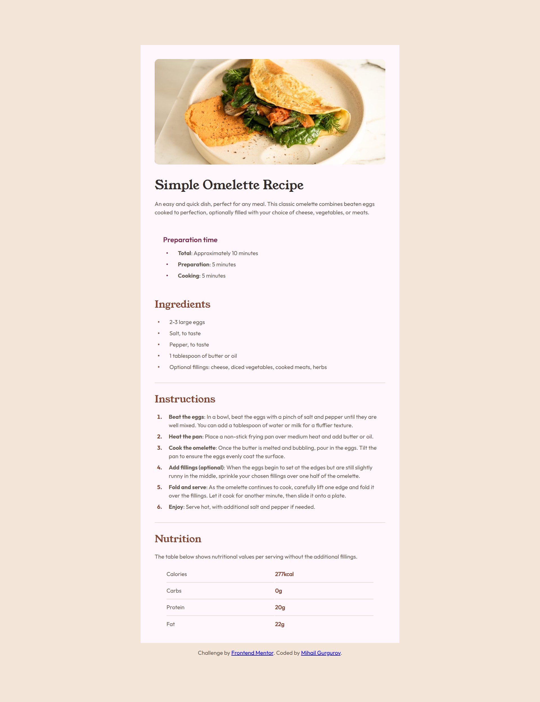

# Frontend Mentor - Recipe page solution

This is a solution to the [Recipe page challenge on Frontend Mentor](https://www.frontendmentor.io/challenges/recipe-page-KiTsR8QQKm). Frontend Mentor challenges help you improve your coding skills by building realistic projects.

## Table of contents

- [Overview](#overview)
    - [Screenshot](#screenshot)
    - [Links](#links)
- [My process](#my-process)
    - [Built with](#built-with)
    - [What I learned](#what-i-learned)
    - [AI Collaboration](#ai-collaboration)
- [Author](#author)

## Overview

### Screenshot



### Links

- Solution URL: [Add solution URL here](https://github.com/Mihasik556/Recipe-Page)
- Live Site URL: [Add live site URL here](https://mihasik556.github.io/Recipe-Page/)

## My process

### Built with

- Semantic HTML5 markup
- CSS custom properties
- Flexbox
- Mobile-first workflow

### What I learned

In this project I learned how to stylize unordered and ordered lists, tables. I didn`t know that you can't just give the list display: flex without markers disappearing. There were a lot of problems with making gaps between the marker and a text. Thanks to Claude, he helped me to remember the ':before' and 'content:'.

```css
ul li::before {
    display: block;
    content: "•";
    font-size: 1.3rem;
    color: #854632;
    margin-right: 1.7rem;
}
```

### AI Collaboration

In this project I sometimes used Claude. He helped me with stylizing lists and a table.
It was difficult to make a gap between markers and blocks of text in the lists so I asked AI how to make it. He gave me a hint to put all texts in some divs to group them so it would be easy to push them from the markers.

## Author

- Frontend Mentor - [@Mihasik556](https://www.frontendmentor.io/profile/Mihasik556)
